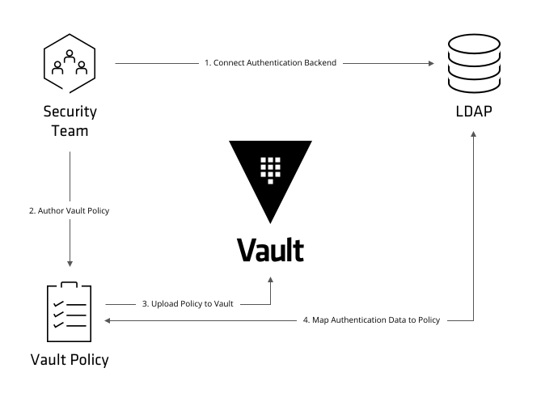

# Vault

HashiCorp Vault is a scalable, modular, platform agnostic tool for generate, manage, and store secrets. By secret is ment anything that one want to tightly control access to. Vault provides a unified, API driven access to wide range of secrets, while providing tight access control and recording a detailed audit log.

## Vaul Concepts


**Vault server** provides an API which clients interact with and manages the interaction between all the secrets engines, ACL enforcement, and secret lease revocation. Having a server based architecture decouples clients from the security keys and policies, enables centralized audit logging and simplifies administration for operators.  

**Storage Backend** is responsible for durable storage of encrypted data. Backends are not trusted by Vault and are only expected to provide durability. The storage backend is configured when starting the Vault server.  

**Barrier** is cryptographic shell around the Vault. All data that flows between Vault and the storage backend passes through the barrier. Once started, the Vault is in a sealed state. Before any operation can be performed on the Vault it must be unsealed. This is done by providing the unseal keys. When the Vault is initialized it generates an encryption key which is used to protect all the data. That key is protected by a master key. By default, Vault uses a technique known as [Shamir's secret sharing](https://en.wikipedia.org/wiki/Shamir's_Secret_Sharing) algorithm to split the master key into shares.  
The number of shares and the minimum threshold required can both be specified. Once Vault retrieves the encryption key, it is able to decrypt the data in the storage backend, and enters the unsealed state. Once unsealed, Vault loads all of the configured audit devices, auth methods, and secrets engines. 

**Auth Method** is used to authenticate users or machines/applications. Once authenticated, the auth method returns the list of applicable policies which should be applied. Vault takes an authenticated user and returns a client token that can be used for future requests.  
Vault supports multiple [auth methods](https://www.vaultproject.io/docs/auth/index.html). When enabled, auth methods are similar to secrets engines: they are mounted within the Vault mount table and can be accessed and configured using the standard read/write API. All auth methods are mounted underneath the auth/ prefix.

**Token** is conceptually similar to a session cookie on a web site. Once a user authenticates, Vault returns a client token which is used for future requests. The token is used by Vault to verify the identity of the client and to enforce the applicable ACL policies. This token is passed via HTTP headers.  

**Policy** is means for scoping Vault tokens. Everything in Vault is path based, and policies are no exception. Policies provide a declarative way to grant or forbid access to certain paths and operations in Vault. Policies authorize a user or application to access specific paths within Vault.  
Paths are created on a [Radix tree](https://en.wikipedia.org/wiki/Radix_tree) for highly performant lookups of secrets and mapping of policies. Authentication methods, secret engines and administrative functions are mapped to paths making it simple to define authorization to all of Vault through one mechanism.  
The default action for a policy is to deny access until paths are whitelisted.

**Secret** is the term for anything stored by Vault which contains confidential or cryptographic material.  

**Audit Device** is responsible for managing audit logs. Every request to Vault and response from Vault goes through the configured audit devices. This provides a simple way to integrate Vault with multiple audit logging destinations of different types.

## Vault Scenario

This Vault crusade is built around fictional scenario: There is a cloud-first company that wants to delegate secret management to Vault. That company has specific needs that Vault needs to fulfill. After gathering all the necessary information, list of objectives is as follows:

- Vault will be used by individuals across all departements (sales, marketing, operations, developers, managers, ...)
- Vault will be used by machines as well (CI/CD pipelines, data pipelines and other present and future automation tools and processes)
- User authentication needs to be delegated to Azure AD.
- Making use of existing Azure AD groups for defining roles and rights is highly appreciated.
- Implement at least two different authentication methods for machines.
- Perform backups at least once per week.
- Ensuring minimum downtime during upgrades is not critical. HA will be considered for a future use.
- Automate all (or almost all) aspects of Vault lifecycle.
- Harden Vault server by following best practices.

To turn this fictional scenario into a reality, Vault implementation will be divided in following phases:

1. [Virtual Machine Deployment](##1.-deploy-vault-on-virtual-machine)
2. [Kubernetes Deployment](##2.-deploy-vault-on-kubernetes)
3. [Initialize and Unseal](##3.-initialize-and-unseal)
4. [Policies](##4.-policies)
5. [Authentication](##5.-authentication)


## 1. Deploy Vault on Virtual Machine

### Install Vault

```
#Install unzip
sudo apt update
sudo apt install unzip -y

#Install Vault
VAULT_VERSION="1.3.0"
wget https://releases.hashicorp.com/vault/${VAULT_VERSION}/vault_${VAULT_VERSION}_linux_amd64.zip
unzip vault_${VAULT_VERSION}_linux_amd64.zip
sudo mv vault /usr/local/bin/

#Check Vault
vault version

#Remove Vault archive
rm vault_${VAULT_VERSION}_linux_amd64.zip

#Create Vault folders
sudo mkdir /etc/vault
sudo mkdir -p /var/lib/vault/data

#Define Vault service
sudo nano /etc/systemd/system/vault.service

#Create Vault config file
sudo nano /etc/vault/config.hcl

#Add certificates
sudo mkdir /etc/vault/certs

sudo cp app.crt /etc/vault/certs/app.crt
sudo cp app.key /etc/vault/certs/app.key

#Create Vault user
sudo useradd --system --home /etc/vault --shell /bin/false vault
sudo chown -R vault:vault /etc/vault /var/lib/vault/

#Start and enable vault service to start on system boot.
sudo systemctl daemon-reload
sudo systemctl enable --now vault

systemctl status vault
   ```

## 2. Deploy Vault on Kubernetes
Postponed for next evolution of Vault implementation, when HA will be considered.

## 3. Initialize and Unseal

### Initialize
*Initialization* is the process configuring the Vault. This only happens once when the server is started against a new backend that has never been used with Vault before (When running in HA mode, this happens once per cluster, not per server).
```
vault operator init [OPTIONS]
```  
This is an unauthenticated request, but it only works on brand new Vaults with no data. To initialize with three key shares (threshold of two)
```
vault operator init -key-shares=3 -key-threshold=2
```
During initialization, the encryption keys are generated, unseal keys are created, and the initial root token is setup.

### Unseal

```
vault operator unseal
```

## 4. Policies



*To create a policy*  
```
vault policy write reader reader.hcl
```

## 5. Authentication
Following scenario, OIDC auth method will be setup for AzureAD authentication for users. For machines AppRole will be setup.

### Configure Vault OIDC auth with Azure AD

#### Enable OIDC auth method
```
vault auth enable oidc
```

#### Configure OIDC auth method
1. Register or select an existing AAD application. Keep record of Application ID.
2. Configure Redirect URIs (You may include two redirect URIs, one for Vault UI access another one for CLI access)
   * http://localhost:8250/oidc/callback
   * https://hostname:port_number/ui/vault/auth/oidc/oidc/callback
3. Create a new client secret and record the generated value as it will not be accessible after.
4. Under AAD Application API Permissions grant the following permission:
   * Microsoft Graph API permission Group.Read.All
5. Under "Endpoints", copy the OpenID Connect metadata document URL, omitting the /well-known... portion. The endpoint url (oidc_discovery_url) will look like: https://login.microsoftonline.com/tenant-guid/v2.0
6. Configure previously enable OIDC method
```
vault write auth/oidc/config \
    oidc_client_id="aad_application_id" \
    oidc_client_secret="aad_application_secret" \
    default_role=“default_role” \
    oidc_discovery_url="https://login.microsoftonline.com/tenant-guid/v2.0”
```
*default_role* - default role the user will be using when connecting. If we ommit this from configuration above, this role must be provided during login. It seems convinient to define default role and ease login experience.

Let's create *reader* role so we can use it as default one.
```
vault write auth/oidc/role/reader \
        bound_audiences="aad_application_id" \
        allowed_redirect_uris="https://hostname:port_number/ui/vault/auth/oidc/oidc/callback" \
        allowed_redirect_uris="https://localhost:8250/oidc/callback" \
        user_claim="email" \
        policies="reader"
```

### Use Vault external groups with OIDC auth method and Azure AD
There is a notion of external groups in Vault. External group serves as a mapping to a group that is outside of the Vault identity store. External groups can have one (and only one) alias. This alias should map to a Object ID attribute of Azure AD.

Some constraints to be aware of:

- Azure AD v2.0 endpoints are required for registering application.
- *groupMembershipClaims* should be changed from none in the App registration manifest (Options are "All" or "Security").
- In the OIDC Role config the scope "https://graph.microsoft.com/.default" should be added to add groups to the jwt token and groups_claim should be set to groups.
- Azure AD group can be referenced by using the groups objectId as the group alias name for the Vault external group (next step).

To provide, for example,  all DevOps AAD members with devops Vault policy (in addition to already provided reader policie) coupule of steps are required:

#### Create DevOps policy 
```
vault policy write devops devops.hcl
```

#### Create DevOps role 
```
vault write auth/oidc/role/devops \
        bound_audiences="aad_application_id" \
        allowed_redirect_uris="https://hostname:port_number/ui/vault/auth/oidc/oidc/callback" \
        allowed_redirect_uris="https://localhost:8250/oidc/callback" \
        user_claim="email" \
        policies="devops" \
        groups_claim="groups" \
        oidc_scopes="openid, email, https://graph.microsoft.com/.default"
```

#### Create Vault external group
1. Create an external group with policy attached:
```
vault write identity/group name="devopsg" type="external" policies="devops"
```
Keep record of ID of created group

2. Create a group alias
```
vault write identity/group-alias name=azure_aad_object_id \
      mount_accessor=oidc_auth_accessor \
      canonical_id=group_id
```
azure_aad_object_id - Object ID attribute of Azure AD Group  
oidc_auth_accessor - accessor of desired auth backend (```vault auth list``` to find out)  
canonical_id - Vault group ID from step 1  

### Configure AppRole auth method
The approle auth method is oriented to automated workflows (machines and services). An "AppRole" represents a set of Vault policies and login constraints that must be met to receive a token with those policies.  

Auth methods must be configured in advance before users or machines can authenticate. These steps are usually completed by an operator or configuration management tool.

1. Create desired policy (we will use already defined devops policy)
```
vault policy write devops devops.hcl
```

2. Enable approle auth method
```
vault auth enable approle
```

3. Create devops role for approle auth backend
```
vault write auth/approle/role/devops policies="devops"
```
or (with more configurations)
```
vault write auth/approle/role/devops policies="devops" token_ttl=33m token_max=33m secret_id_num_users=1
```

The default path is /approle. If this auth method was enabled at a different path, specify auth/my-path/login instead. Two important pieces are needed before final login and token retrieval:
*RoleID* is an identifier that selects the AppRole against which the other credentials are evaluated.
*SecretID* is a credential that is required by default for any login (requiring a SecretID can be disabled). SecretIDs can be created against an AppRole (Pull mode) or via specific, custom values (Push mode).

1. Fetch the RoleID of the AppRole
```
vault read auth/approle/role/devops/role-id
```
2. Get a SecretID issued against the AppRole
```
vault write -f auth/approle/role/devops/secret-id
```
3. Grab a token by passing RoleID and SecretID
```
vault write auth/approle/login role_id=... secret_id=...
```